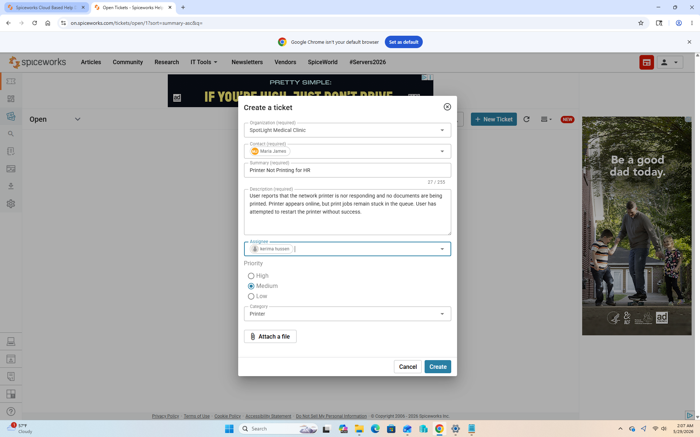
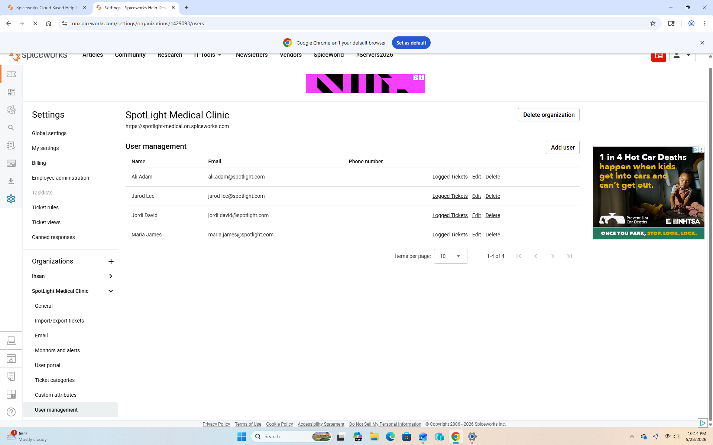
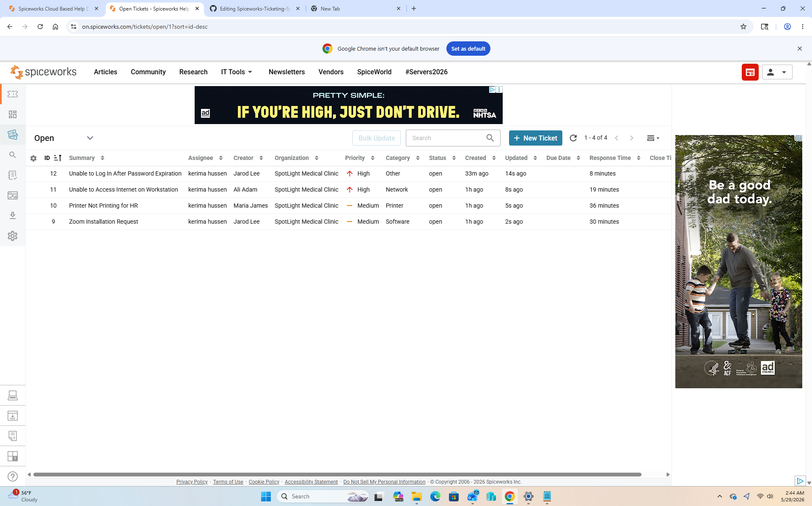
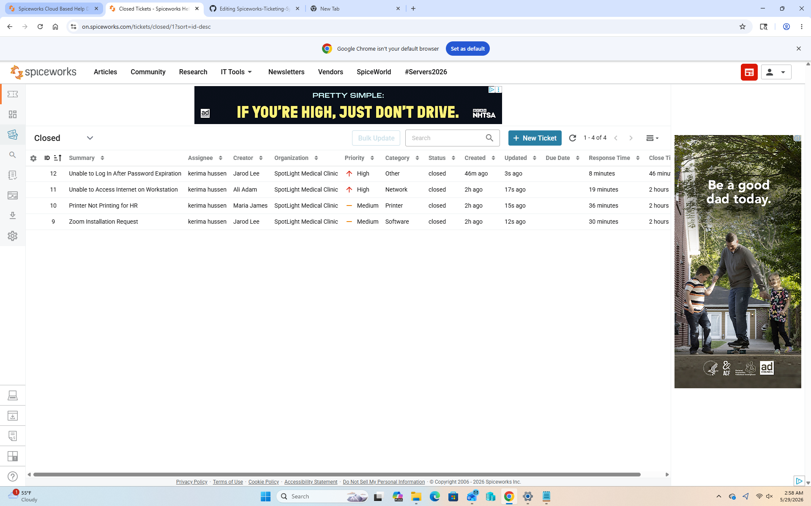
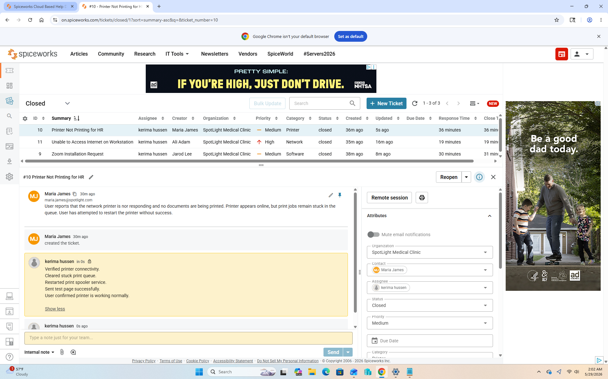
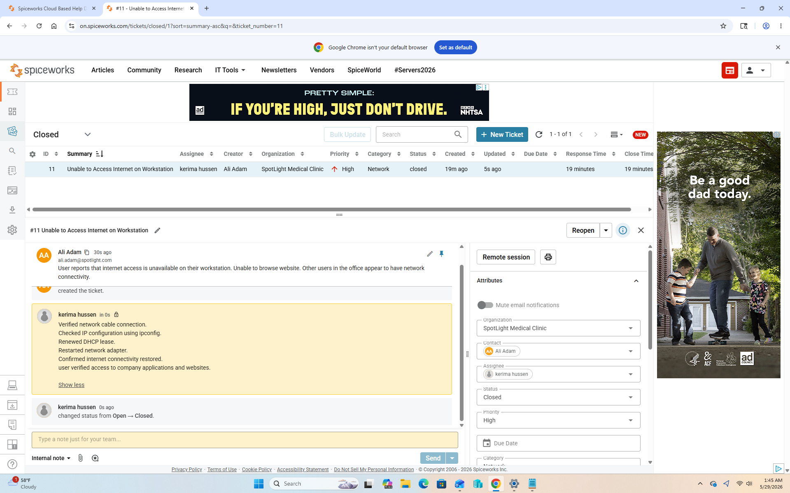

# Help Desk Ticketing System Lab Using Spiceworks

    
  

This project demonstrates hands-on help desk ticket management using Spiceworks. The goal of this lab was to simulate real-world IT support workflows by creating, categorizing, prioritizing, troubleshooting, documenting, and resolving support tickets in a help desk environment.

The project focused on the complete ticket lifecycle, including ticket creation, user communication, issue prioritization, troubleshooting documentation, escalation awareness, and professional ticket closure procedures.

## Project Objectives

- Practice help desk ticket management in a simulated environment
- Learn ticket categorization and prioritization
- Improve troubleshooting documentation skills
- Develop professional user communication
- Simulate common IT support incidents
- Build a portfolio-ready help desk project for GitHub and resume use

## Tools Used

- Spiceworks Help Desk
- Windows 11
- Command Prompt
- Windows Settings
- Device Manager
- AnyDesk
- Web Browser

 ## Skills Demonstrated

- Ticket creation and management
- Incident tracking
- Issue categorization
- Priority assignment
- User communication
- Troubleshooting documentation
- Password reset procedures
- Software support
- Printer troubleshooting
- Network troubleshooting
- Ticket resolution workflow

## Lab Activities

- Created support tickets in Spiceworks
- Assigned categories and priorities
- Documented troubleshooting steps
- Updated users throughout the support process
- Escalated issues when necessary
- Resolved and closed tickets professionally
- Simulated common help desk scenarios

 ## Example Scenarios

- Password reset requests
- Software installation requests
- Printer connectivity issues
- Network connectivity problems
- Remote support requests
- Slow computer performance
- User account access issues

# Ticket Lifecycle

1. User submits support request
2. Ticket is created in Spiceworks
3. Ticket is categorized and prioritized
4. Ticket is assigned to a technician
5. Troubleshooting is performed
6. Internal notes are documented
7. Resolution is provided
8. Ticket is closed

## Screenshots
<h3>Dashboard and Ticket Resolution</h3>
<body>Created and managed support tickets using the Spiceworks Help Desk dashboard. Verified issue resolution, updated documentation, and closed the support ticket.</body>

<h3>Software Installation Request and Printer Troubleshooting</h3>
<body>Processed a software installation request and documented the deployment process. Diagnosed and resolved a printer connectivity issue while documenting corrective actions.</body>

### Network Connectivity Troubleshooting 

Investigated and resolved a network connectivity problem using standard troubleshooting procedures.

## Outcome

Successfully simulated and resolved multiple help desk incidents including password reset requests, printer issues, software installation requests, and network connectivity problems. Demonstrated ticket creation, categorization, prioritization, troubleshooting, documentation, and ticket closure using Spiceworks Help Desk.

